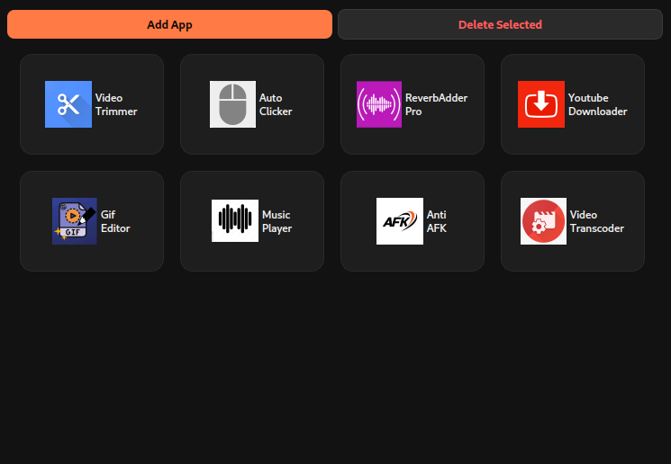

# App Suite Launcher

A lightweight launcher for creating a personalized dashboard of your favorite Linux applications.

Instead of searching through your application menu, simply add your preferred `.desktop` launchers and access them from a clean, customizable grid.



> **⚠️ This application is designed for Linux desktop environments.**
>
> It **does not support Windows or macOS**.

## Features

* Add applications from existing `.desktop` launchers
* Launch applications with a single click
* Automatic icon loading from your system theme
* Remove applications from the launcher
* Clean grid layout
* Lightweight PyQt6 interface
* Automatically saves your launcher configuration

## Supported Platforms

* ✅ Linux (GNOME, KDE Plasma, XFCE, Cinnamon, MATE, etc.)
* ❌ Windows
* ❌ macOS

This application follows the Linux XDG Desktop standards and uses `.desktop` launcher files.

## Requirements

* Python 3.10 or newer (recommended)

### Python Dependencies

Install with:

```bash
pip install -r requirements.txt
```

or

```bash
pip install PyQt6
```

### requirements.txt

```text
PyQt6
```

## System Requirements

This application expects a standard Linux desktop environment with:

* `.desktop` launcher files
* `gtk-launch`
* XDG application directories
* A desktop icon theme

Most desktop Linux distributions already include these components.

## Installation

Clone the repository:

```bash
git clone https://github.com/USERNAME/REPOSITORY.git
cd REPOSITORY
```

(Optional) Create a virtual environment:

```bash
python3 -m venv .venv
source .venv/bin/activate
```

Install the dependency:

```bash
pip install -r requirements.txt
```

Run the application:

```bash
python main.py
```

## Usage

1. Launch the application.
2. Click **Add App**.
3. Select a `.desktop` file (typically found in `/usr/share/applications` or `~/.local/share/applications`).
4. Your application will appear as a launcher tile.
5. Click a tile to launch the application.
6. Select a tile and click **Delete Selected** to remove it from the launcher.

Your launcher configuration is automatically saved and restored the next time the application starts.

## Configuration

Application data is stored in:

```text
~/.app_suite_launcher.json
```

Only references to your selected `.desktop` files are stored—your installed applications are not modified.


## Project Structure

```text
.
├── main.py
├── requirements.txt
├── assets/
└── README.md
```

## Notes

* Applications are launched using `gtk-launch`.
* Icons are loaded from your current desktop icon theme when available.
* Applications without a matching icon theme entry will still appear, but may display a generic or blank icon depending on your desktop environment.
* The launcher is compatible with both X11 and Wayland because it relies on standard Linux desktop services rather than X11-specific APIs.

## License

This project is open source. Feel free to modify and distribute it under the terms of the license included with this repository.
